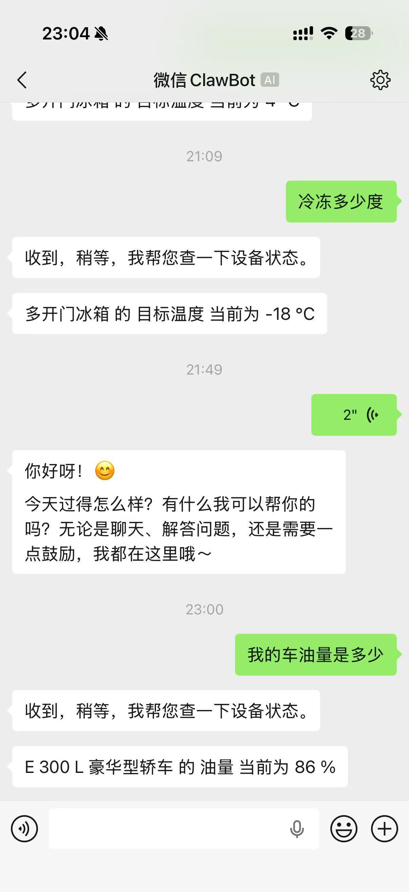
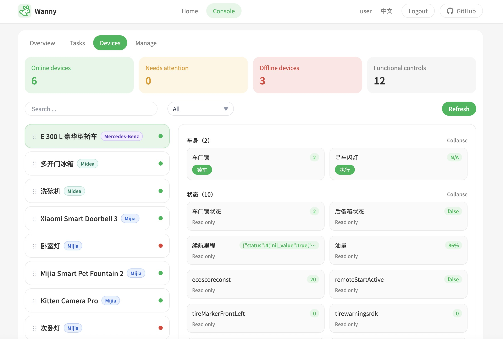

# Wanny - Your AI Super Butler

English README | [中文说明](./README.zh-CN.md)

Wanny is an all-in-one butler system that connects WeChat, smart devices, and service providers. It supports natural-language control, long-term memory, proactive care, and a unified console across home automation, messaging, and mobility scenarios.

For the overall product introduction, system composition, and architecture overview, start with [2026-03-29-wanny-design.md](./docs/superpowers/specs/2026-03-29-wanny-design.md).

This repository is licensed under [Apache License 2.0](./LICENSE). Third-party submodules under `third_party/` retain their own upstream licenses.

> Important Notice
>
> - This project is intended for personal learning, experimentation, and non-commercial use only.
> - It is under active and rapid iteration, with the goal of exploring broader possibilities for AI in device control, automation, memory, and agent-driven execution.
> - You are welcome to star the repository, open issues, contribute code, and help connect more physical devices and real-world integrations.
> - Please use it with care: AI-driven operations may trigger real commands, affect connected devices or external services, and introduce practical safety risks.
> - You are responsible for evaluating whether a given setup, authorization, or action is safe for your environment.
> - By using this project, you accept the associated risks; the repository maintainer does not assume liability for loss, damage, service disruption, or unsafe outcomes caused by usage, misconfiguration, automation side effects, or third-party platform changes.

## 🌐 Supported Platforms

- **Messaging entry**: WeChat
- **Smart home platforms**: Mijia, Midea
- **Mobility platforms**: Mercedes-Benz
- **Automation hubs**: Home Assistant

## 🖼️ Product Preview

### WeChat Control Demo



### Console Panel



## 🚀 Core Capabilities

### 1. Smart Device Control (Jarvis Brain)

- **Sense, decide, execute**: Monitor device states in real time, reason over scenes and modes, and drive actions through a unified control layer.
- **Behavior learning**: Learn recurring habits, convert repeated confirmations into trusted automations, and keep the user in control.
- **Permission matrix**: Configure whether each action should ask, always allow, or never allow under different scenarios.

### 2. AI Command Agent (Jarvis Shell)

- **Natural-language interaction**: Talk to Wanny through WeChat for everyday questions, device operations, and task execution.
- **Simple vs. complex task routing**:
  - Lightweight requests can be answered directly by the backend prompt flow.
  - Multi-step tasks can be expanded into shell-oriented execution flows through the AI agent.
- **Manual gate**: Any system-level operation must still be explicitly approved by the user over WeChat before execution.
- **Safety roadmap**: The project is designed to evolve toward stronger isolation with sandboxed and containerized execution.

### 3. Long-Term Memory and Proactive Care

- **Dual-track memory**:
  - **Memory A (semantic vectors)** stores dialogue fragments for retrieval and context recall.
  - **Memory B (structured profile)** extracts durable preferences such as temperature habits or entertainment preferences.
- **Daily review**: Wanny can summarize and refine user understanding over time.
- **Proactive suggestions**: Environmental events, routines, and contextual signals can trigger timely reminders without becoming spammy.

## 🛠️ Tech Stack

- **Backend**: Django 6.0 + Django Channels (WebSocket)
- **Database**: MySQL + vector storage (ChromaDB/FAISS)
- **AI Engine**: Gemini CLI (`gemini`)
- **Messaging**: WeChat iLink protocol (`wechatbot-sdk`)
- **Device Integrations**: Mijia API (`mijiaAPI`), Midea cloud, Mercedes `mbapi2020`
- **Frontend**: Vue 3 + Vite + TypeScript + Tailwind CSS + shadcn-vue + vue-i18n

## 📁 Repository Structure

```text
/wanny
  /backend           # Django workspace
    /apps
      /brain         # LLM agent logic and decision hub
      /comms         # WeChat gateway and routing
      /database      # Core ORM models and storage
      /memory        # Long-term memory and profile extraction
      /devices       # Device aggregation and control
      /providers     # Third-party provider integrations
  /frontend          # Vue 3 frontend workspace (Landing Page + Jarvis Console)
  /docs              # Design specs, implementation notes, and plans
  /third_party       # Third-party source references, migration aids, acknowledgements
```

## 📖 Project Documents

- The system overview lives in [2026-03-29-wanny-design.md](./docs/superpowers/specs/2026-03-29-wanny-design.md).
- Detailed specifications and implementation notes live under [`docs/superpowers/specs`](./docs/superpowers/specs).
- Chinese documentation is available in [README.zh-CN.md](./README.zh-CN.md).

## 🖥️ Frontend Workspace

- `frontend/` contains the public landing page and the console UI.
- The current frontend stack is Vue 3 + Vite + TypeScript + Tailwind CSS + shadcn-vue + vue-i18n.
- For frontend-specific run instructions, see `frontend/README.md`.

## 🔐 Safety and Rules

- **Privacy first**: Sensitive operations remain gated and local-first where possible.
- **Execution filters**: Dangerous commands such as `sudo` or destructive file removal should be blocked by policy.
- **AI rule chain**: Root-level `README.md` and `README.zh-CN.md` explain the project, while `GEMINI.md`, `backend/GEMINI.md`, and `frontend/GEMINI.md` define operational AI rules.

## 🙏 Third-Party References and Acknowledgements

- `third_party/midea_auto_cloud` is included as a Git submodule and used as a reference implementation for Midea integration work. Upstream license: Apache License 2.0.
- `third_party/mbapi2020` is included as a Git submodule and used as a reference implementation for Mercedes integration work. Upstream license: MIT License.
- These repositories are used for protocol study, field mapping, and migration reference rather than as runtime dependencies of Wanny.
- Thanks to [`sususweet/midea_auto_cloud`](https://github.com/sususweet/midea_auto_cloud) for the upstream Home Assistant integration and implementation ideas.
- Thanks to [`ReneNulschDE/mbapi2020`](https://github.com/ReneNulschDE/mbapi2020) for the upstream Home Assistant integration and implementation ideas.

## ⚠️ Disclaimer

- This project may contain third-party dependencies, third-party reference implementations, or compatibility code derived from public information and community projects. Intellectual property, licensing, and compliance boundaries remain subject to the original upstream terms.
- Some integrations may rely on unofficial interfaces, undocumented APIs, reverse engineering, packet inspection, or compatibility adaptations. That does not imply official support from the related platforms and does not guarantee long-term stability.
- If you connect third-party accounts, devices, apps, or cloud services, evaluate the risks yourself, including API changes, rate limiting, account controls, service policy restrictions, and regional differences.
- The project should be treated as an experimental system for research, learning, personal integration, and compatibility exploration unless you have separately validated legal, operational, and security requirements for production use.
- Because Wanny can control real devices and interact with external services, use extra caution around powered devices, heating equipment, locks, unattended automations, and safety-critical scenarios.
- Users remain responsible for deciding whether each authorization, automation, or control instruction is safe for the current environment.

## 🤖 AI Reading Entry

- AI agents should first read root-level `README.md` or `README.zh-CN.md` to understand the project context, repository layout, and workspace boundaries.
- Shared AI rules live in root-level `GEMINI.md`.
- Backend-specific AI rules live in `backend/GEMINI.md`.
- Frontend-specific AI rules live in `frontend/GEMINI.md`.
- Recommended reading order:
  1. `README.md`
  2. `README.zh-CN.md`
  3. `GEMINI.md`
  4. `backend/GEMINI.md` or `frontend/GEMINI.md`

`GEMINI.md` is for AI behavior rules rather than product introduction. Project background, structure, and run instructions should remain in the relevant `README` files.

### Midea Mapping Audit

- The backend exposes `uv run python manage.py audit_midea_mapping --limit 80` to scan for high-risk Midea mapping issues.
- This helps catch raw labels, untranslated option text, and low-level state leakage before they regress into the device UI.
