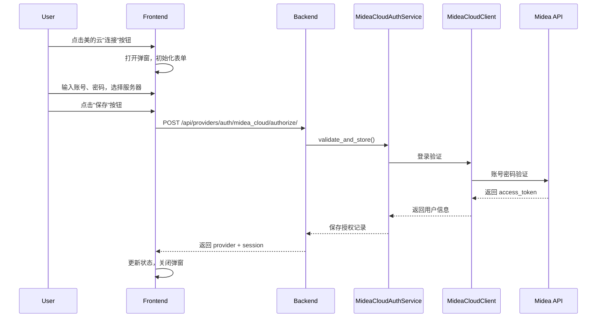

# 美的云授权前端功能设计

## 1. 概述

为 Wanny 前端新增美的云（Midea Cloud）授权功能，允许用户通过表单输入账号、密码和服务器选择，完成美的智能家居平台的授权连接。

## 2. 需求背景

- 后端已支持美的云授权接口 (`POST /api/providers/auth/midea_cloud/authorize/`)
- 前端已有 Home Assistant 表单授权的实现模式可复用
- 用户需要选择服务器类型（MSmartHome 或 美的美居）

## 3. 实现方案

### 3.1 方案选择

采用方案 A：复用现有 Home Assistant 弹窗模式，在 `ManagePage.vue` 中新增美的云表单处理逻辑。

**理由**：
- 改动最小，风险最低
- Home Assistant 已证明此模式可行
- 用户已有熟悉的使用习惯
- 代码改动集中，便于维护

### 3.2 改动文件

| 文件 | 改动类型 | 说明 |
|------|----------|------|
| `frontend/src/pages/console/ManagePage.vue` | 修改 | 新增美的云表单 UI 和处理逻辑 |
| `frontend/src/i18n/zh-CN/manage.ts` | 修改 | 新增美的云相关中文文案 |
| `frontend/src/i18n/en/manage.ts` | 修改 | 新增美的云相关英文文案 |

## 4. 详细设计

### 4.1 ManagePage.vue 改动

#### 4.1.1 新增状态变量

```typescript
// 美的云表单状态
const mideaCloudAccount = ref("");
const mideaCloudPassword = ref("");
const mideaCloudServer = ref<"1" | "2">("2"); // 默认美的美居

// 计算属性：是否为美的云弹窗
const isMideaCloudModal = computed(() => modalProvider.value?.platform === "midea_cloud");

// 美的云服务器选项
const mideaServerOptions = [
  { value: "1", label: "MSmartHome" },
  { value: "2", label: "美的美居" },
];
```

#### 4.1.2 新增表单处理函数

```typescript
async function handleMideaCloudAuthorize() {
  const provider = modalProvider.value;
  if (!provider || provider.platform !== "midea_cloud") return;

  modalLoading.value = true;
  busyAction.value = `${provider.platform}:connect`;
  errorMessage.value = "";

  try {
    const response = await startAuthorization(provider.platform, {
      payload: {
        account: mideaCloudAccount.value.trim(),
        password: mideaCloudPassword.value.trim(),
        server: parseInt(mideaCloudServer.value),
      },
    });
    updateProvider(response.provider);
    sessions.value = { ...sessions.value, [provider.platform]: response.session };
    mideaCloudPassword.value = ""; // 清除密码
    closeModal();
  } catch (error) {
    errorMessage.value = error instanceof Error ? error.message : t("manage.auth.errors.action");
  } finally {
    busyAction.value = "";
    modalLoading.value = false;
  }
}
```

#### 4.1.3 修改 handleClick 函数

在现有 `handleClick` 函数中增加美的云判断：

```typescript
async function handleClick(provider: ProviderRecord) {
  // Home Assistant 或美的云需要先输入配置信息，直接打开弹窗
  if (provider.platform === "home_assistant" || provider.platform === "midea_cloud") {
    openModal(provider.platform);
    return;
  }
  // ... 原有逻辑
}
```

#### 4.1.4 修改 openModal 函数

初始化美的云表单默认值：

```typescript
function openModal(platform: string) {
  modalPlatform.value = platform;
  const provider = providers.value.find((p) => p.platform === platform);

  if (platform === "home_assistant") {
    // Home Assistant 初始化逻辑
  }

  if (platform === "midea_cloud") {
    const preview = provider?.payload_preview ?? {};
    mideaCloudAccount.value = typeof preview.account === "string" ? preview.account : "";
    mideaCloudPassword.value = "";
    mideaCloudServer.value = typeof preview.server === "number" ? String(preview.server) : "2";
  }
}
```

#### 4.1.5 修改 closeModal 函数

清除美的云表单状态：

```typescript
function closeModal() {
  modalPlatform.value = null;
  modalLoading.value = false;
  homeAssistantAccessToken.value = "";
  mideaCloudPassword.value = ""; // 清除密码
}
```

### 4.2 UI 设计

#### 4.2.1 弹窗表单布局

在 `<Dialog>` 内新增美的云表单区块，位于 Home Assistant 表单之后：

```vue
<div v-if="isMideaCloudModal" class="space-y-3">
  <!-- 账号输入 -->
  <div class="space-y-1.5">
    <label class="text-xs font-medium uppercase tracking-[0.12em] text-[#888888]">
      {{ $t("manage.auth.fields.account") }}
    </label>
    <input
      v-model="mideaCloudAccount"
      type="text"
      :placeholder="$t('manage.auth.fields.accountPlaceholder')"
      class="w-full rounded-2xl border border-[#EDEDED] bg-[#FCFCFC] px-4 py-3 text-sm text-[#333333] outline-none transition-all duration-200 focus:border-[#07C160] focus:bg-white"
    />
  </div>

  <!-- 密码输入 -->
  <div class="space-y-1.5">
    <label class="text-xs font-medium uppercase tracking-[0.12em] text-[#888888]">
      {{ $t("manage.auth.fields.password") }}
    </label>
    <input
      v-model="mideaCloudPassword"
      type="password"
      :placeholder="$t('manage.auth.fields.passwordPlaceholder')"
      class="w-full rounded-2xl border border-[#EDEDED] bg-[#FCFCFC] px-4 py-3 text-sm text-[#333333] outline-none transition-all duration-200 focus:border-[#07C160] focus:bg-white"
    />
  </div>

  <!-- 服务器选择 -->
  <div class="space-y-1.5">
    <label class="text-xs font-medium uppercase tracking-[0.12em] text-[#888888]">
      {{ $t("manage.auth.fields.server") }}
    </label>
    <div class="flex gap-2">
      <button
        v-for="option in mideaServerOptions"
        :key="option.value"
        :class="[
          'flex-1 px-4 py-2.5 rounded-full text-sm font-medium transition-all duration-200',
          mideaCloudServer === option.value
            ? 'bg-[#07C160] text-white shadow-sm'
            : 'bg-[#F7F7F7] text-[#888888] hover:bg-[#EDEDED] hover:text-[#333333]'
        ]"
        @click="mideaCloudServer = option.value"
      >
        {{ option.label }}
      </button>
    </div>
  </div>

  <!-- 提示信息 -->
  <div class="rounded-2xl border border-[#E8F1EA] bg-[#F5FBF7] px-4 py-3 text-xs text-[#4E6A57] leading-relaxed">
    <div class="font-medium mb-1">{{ $t("manage.auth.hint.midea_cloud") }}</div>
    <div class="text-[#6C8373]">{{ $t("manage.auth.hint.midea_server_info") }}</div>
  </div>

  <!-- 提交按钮 -->
  <button
    :disabled="modalLoading || !mideaCloudAccount.trim() || !mideaCloudPassword.trim()"
    class="w-full rounded-full bg-[#07C160] px-4 py-3 text-sm font-medium text-white transition-all duration-200 hover:-translate-y-0.5 hover:shadow-md disabled:cursor-not-allowed disabled:opacity-50 disabled:hover:translate-y-0"
    @click="handleMideaCloudAuthorize"
  >
    {{ $t("manage.auth.actions.save") }}
  </button>
</div>
```

### 4.3 国际化文案

#### 4.3.1 中文文案 (zh-CN/manage.ts)

```typescript
// 新增字段标签
fields: {
  // ... 现有字段
  account: "账号",
  accountPlaceholder: "美的账号（手机号/邮箱）",
  password: "密码",
  passwordPlaceholder: "美的账号密码",
  server: "服务器",
}

// 新增提示信息
hint: {
  // ... 现有提示
  midea_cloud: "美的云授权",
  midea_server_info: "请使用美的美居或 MSmartHome App 的账号密码。不同服务器对应不同 App 平台。",
}

// 新增错误信息
errors: {
  // ... 现有错误
  mideaAuthFailed: "美的云授权失败，请检查账号密码",
}
```

#### 4.3.2 英文文案 (en/manage.ts)

```typescript
fields: {
  // ... existing fields
  account: "Account",
  accountPlaceholder: "Midea account (phone/email)",
  password: "Password",
  passwordPlaceholder: "Midea account password",
  server: "Server",
}

hint: {
  // ... existing hints
  midea_cloud: "Midea Cloud Authorization",
  midea_server_info: "Use your Midea Meiju or MSmartHome App account. Different servers correspond to different App platforms.",
}

errors: {
  // ... existing errors
  mideaAuthFailed: "Midea Cloud authorization failed, please check your credentials",
}
```

## 5. 设计规范遵守

遵循 `docs/frontend-design-spec.md` 中的规范：

- **配色**：主按钮 `#07C160` 微信绿，输入框边框 `#EDEDED`
- **圆角**：按钮/标签使用 `rounded-full`，输入框使用 `rounded-2xl`
- **交互反馈**：按钮 hover 上浮 `-translate-y-0.5` + 阴影 `shadow-md`
- **状态标签**：服务器选择按钮选中态为绿色背景白色文字
- **响应式**：弹窗宽度 `max-w-sm`，适配移动端

## 6. 数据流



## 7. 安全考虑

- 密码输入框使用 `type="password"` 隐藏输入
- 授权成功后立即清除密码状态 `mideaCloudPassword.value = ""`
- 密码不存储在前端，仅用于一次性授权请求
- 后端验证后会存储 access_token 而非原始密码

## 8. 测试要点

1. **表单验证**：账号密码为空时按钮禁用
2. **服务器选择**：点击切换按钮样式正确变化
3. **授权成功**：弹窗关闭，provider 状态更新为 connected
4. **授权失败**：显示错误信息，弹窗保持打开
5. **已有授权**：payload_preview 显示已保存的账号和服务器
6. **国际化**：中英文切换正确显示对应文案